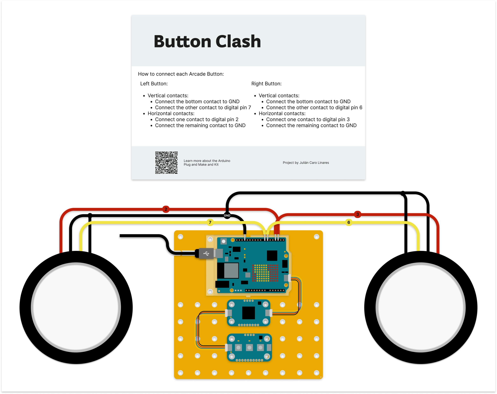

# Button Clash

Button Clash is an exciting two-player game where the person who pushes their button faster wins! Built it with the Arduino Plug and Make kit.

All the step-by-step instructions, including connection digrams, can be found in Arduino ProjectHub:

[https://projecthub.arduino.cc/jcarolinares/e59c12e6-bb73-4bd0-ba05-4578863eeb37](https://projecthub.arduino.cc/jcarolinares/e59c12e6-bb73-4bd0-ba05-4578863eeb37)

You can find the Arduino sketch of the project at the folder "button_clash_game_plug_and_make". There is an additional version of the program that uses two buzzers instead of one in the "Maker Faire folder".

Connect the arcade buttons following the diagram from below:

Once you have everything connected you just need to upload the code to your board, have fun!

***

 Button Clash by Julián Caro Linares for Arduino Inc licensed by <a rel="license" href="http://creativecommons.org/licenses/by-sa/4.0/">Creative Commons Attribution-ShareAlike 4.0 International License</a>.  

